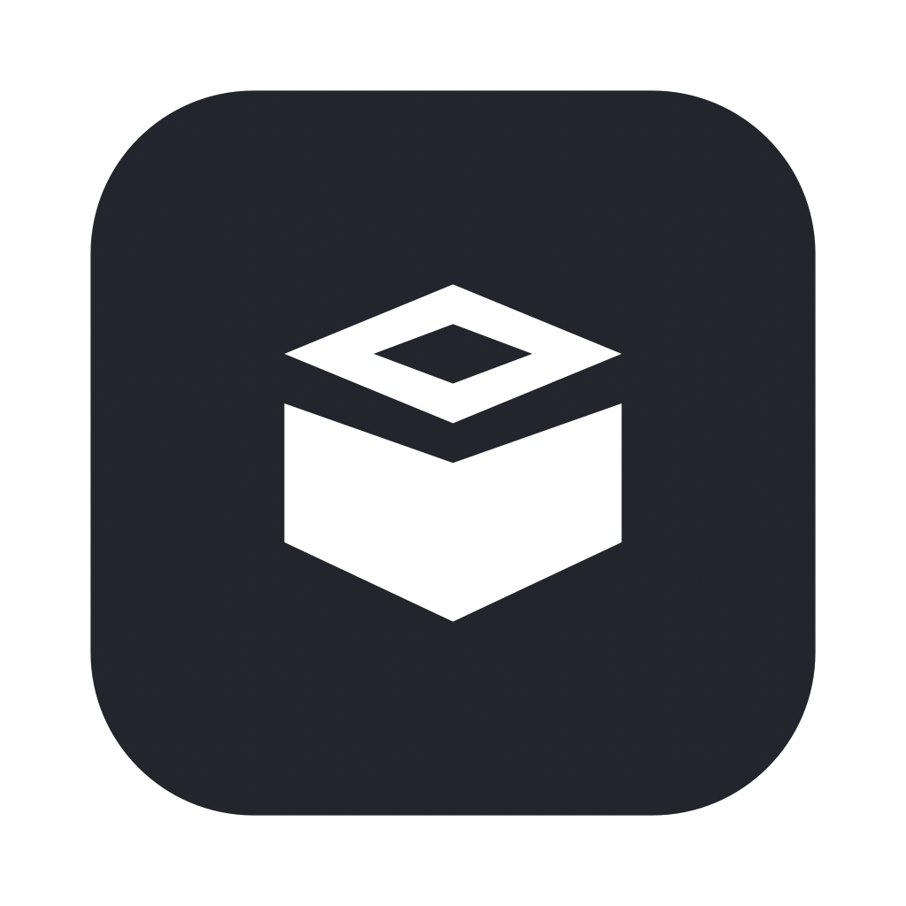
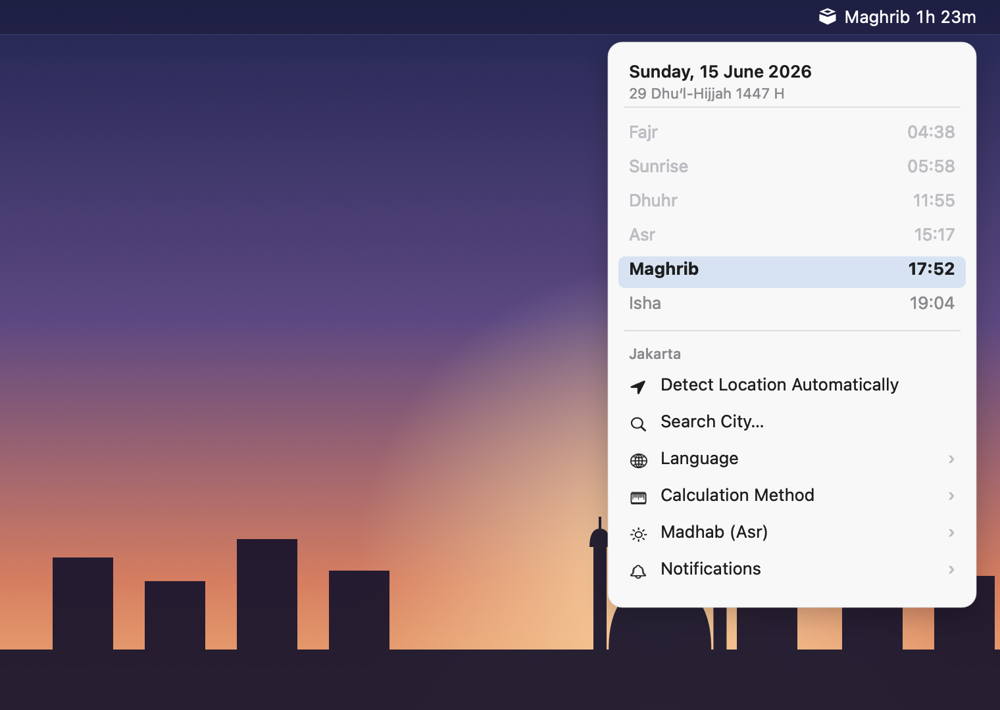

<div align="center">



# Munada

**A lightweight macOS menu bar app for Muslim prayer times.**

Next prayer and a live countdown in the menu bar, today's full schedule in the
dropdown — computed offline, no network, no tracking.




</div>

## Features

- Next prayer name + countdown in the menu bar
- Today's schedule with the current prayer highlighted; sunrise shown as info
- Offline calculation via [Adhan](https://github.com/batoulapps/adhan-swift)
- 13 calculation methods (Kemenag, Umm al-Qura, ISNA, MWL, Egyptian, Karachi,
  Turkey, and more); Kemenag applies the standard Indonesian ihtiyati margin
- Madhab selector for Asr (Shafi/Maliki/Hanbali vs Hanafi)
- Per-prayer manual minute adjustments to match a local schedule
- Location by GPS or city search; suggests the method commonly used in the
  detected country
- Local notifications at each prayer time with an optional pre-alert
- Open at login
- Languages: Indonesian, English, Arabic (defaults to the system language)

## Download

1. Download **Munada.zip** from the [latest release](../../releases/latest) and unzip it.
2. Move **Munada.app** into `/Applications`.
3. The app isn't notarized by Apple yet, so the first launch is blocked with
   *"Apple could not verify Munada is free of malware."* This is expected for an
   unsigned open-source app. Clear it once in Terminal:

   ```sh
   xattr -dr com.apple.quarantine /Applications/Munada.app
   ```

   Then open Munada from Launchpad or Applications. (On macOS Sequoia the
   right-click → **Open** trick no longer works — use the command above, or go to
   **System Settings → Privacy & Security** and click **Open Anyway**.)

> Munada runs entirely on your Mac — no account, no network, no tracking. The
> warning only appears because the build isn't signed with a paid Apple
> Developer ID; the source in this repo is exactly what the binary runs. A
> notarized, warning-free build is planned.

## Build from source

Requires macOS 13+, Xcode, and [XcodeGen](https://github.com/yonaskolb/XcodeGen).

```sh
xcodegen generate
xcodebuild -project Munada.xcodeproj -scheme Munada -configuration Release \
  -derivedDataPath build build
```

The built app is at `build/Build/Products/Release/Munada.app`. Copy it to
`/Applications` to install. Dependencies are fetched automatically via Swift
Package Manager.

## Accuracy

Prayer times are astronomical calculations. Methods differ by region — pick the
one used where you live, and use the per-prayer adjustments to match your local
authoritative schedule if needed. Always verify against a trusted local source.

## License

MIT — see [LICENSE](LICENSE). Prayer time calculations use Adhan, also MIT.
